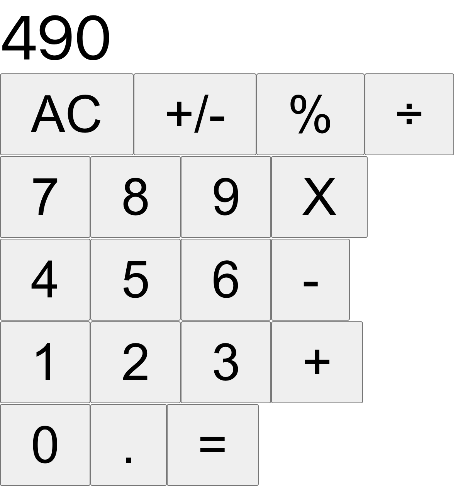

# Calculator

> This project is a calculator built using React.

The purpose of this project is to demonstrate competence in React fundamentals such as using stateful and stateless components.
At the time of writing, the main focus of the work has been on building the components and ensuring that they interact in such a way that the calculator works well. The appearance of the calculator has been left bare, but this could easily be remedied in the future with some basic styling.

## Built With

- **React** (bootstrapped using the [**create-react-app**](https://www.npmjs.com/package/create-react-app) template)

## Local Setup

### Prerequisites

_**node.js is a pre-requisite of this project.**_

Don't have node.js? Choose a download method [here](https://nodejs.org/en/download/).

## Setup Instructions

To set this project up locally, follow these simple instructions:

1. Open a Terminal and navigate to the location in your system where you would like to download the project. **New to Terminal? [Learn here](https://www.freecodecamp.org/news/conquering-the-command-line-f85f5e46c07c/).**

2. Enter the following line of code to clone this repository:

`git clone git@github.com:Joseph-Burke/calculator.git`

3. Now that the repository has been cloned, navigate inside it using `cd calculator`.

4. The project's dependencies are managed by npm. The details of this project's dependencies can be found in `package.json`. To install them, enter the following line of code in the Terminal.

`npm install`

5. Congratulations! All dependencies have now been installed. The source code may now be compiled. Enter the following line of code in the terminal: 

`npm run build`

6. Once the code has been compiled, all that is required is to enter `npm run start`. This will run a  script that will serve the project. It should automatically open in your browser, but if it doesn't, open a browser and navigate to http://localhost:3000 

7. Enjoy your calculator!

## Author

👤 **Joe Burke**

- Github: [@Joseph-Burke](https://github.com/Joseph-Burke)
- Twitter: [@__joeburke](https://twitter.com/__joeburke)
- Linkedin: [Joseph Burke](https://www.linkedin.com/in/--joeburke/)

## 🤝 Contributing

Contributions, issues and feature requests are always welcome!

Drop me a line through any of the channels listed above or head directly to the [issues page](issues/).

## Show your support

Hey! Give this project a ⭐️! It costs nothing :)

## Acknowledgments

- This project was built as part of the Microverse Web Development course, which you can learn more about [here](https://www.microverse.org/).

## 📝 License

This project is [MIT](lic.url) licensed.
